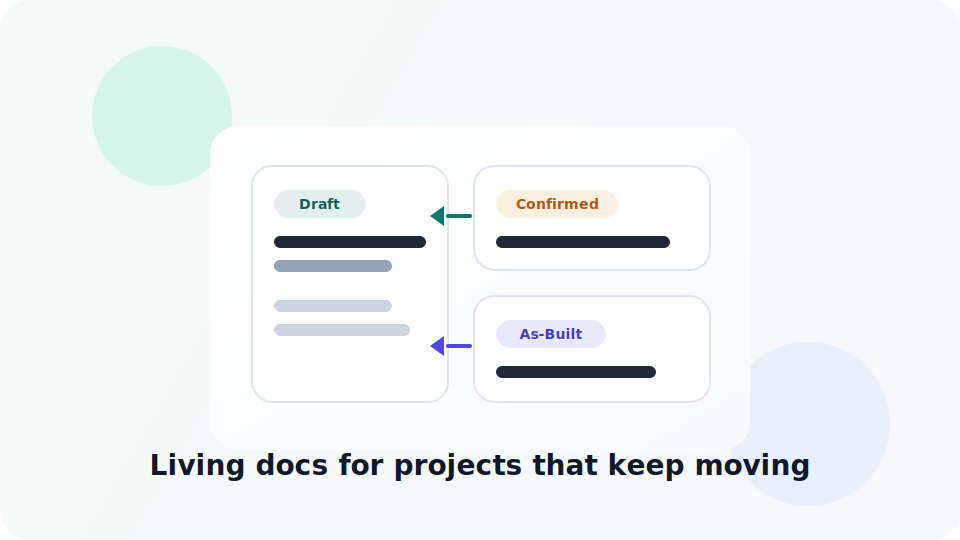
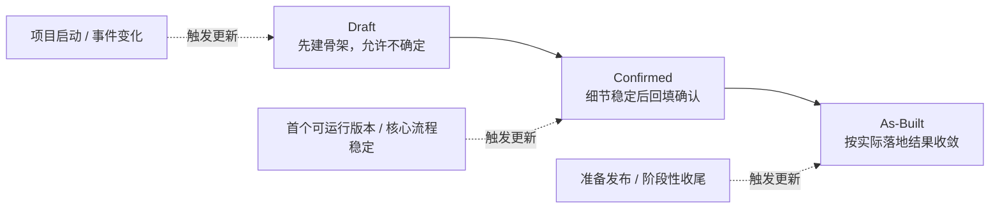

# Vibe Coding Live Docs

<div align="center">
  
  <p>
    <strong>把项目文档从一次性起草，升级成会跟着产品落地一起长大的活文档系统。</strong>
  </p>
  <p>
    
    
    
  </p>
</div>

## 这是什么

`vibe-coding-live-docs` 是一个面向 Codex 的 skill。

它解决的是一个很常见、但很容易被忽略的问题：

> 项目刚开始时，PRD、技术栈、页面框架、核心模块写得很漂亮；  
> 真正开始落地后，细节变了、结构变了、决策也变了，但文档没有跟上。

这个 skill 的目标不是让文档更早写完，而是让文档在项目推进过程中始终有“骨架、回填、收敛”这条生命线。

## 核心理念



文档不是“写完”和“没写完”两种状态，而是 3 个阶段：

- `Draft`
  - 先把项目骨架立起来，允许保留候选方案、草图、待确认项。
- `Confirmed`
  - 当产品细节、页面框架、技术决策、模块边界稳定下来后，再回填成当前执行依据。
- `As-Built`
  - 在发布或阶段性收尾前，按真实落地结果收敛，明确偏差、删减和剩余风险。

## Skill 包含什么

| 模块 | 作用 |
| --- | --- |
| `SKILL.md` | 触发条件、主流程、文档契约、常见误区 |
| `references/living-docs-playbook.md` | 完整活文档手册 |
| `references/update-matrix.md` | 里程碑和事件触发的更新矩阵 |
| `assets/templates/` | `PRD / ARCHITECTURE / PROJECT_STATE / PAGE_FRAME / TECH_DECISIONS` 等模板 |
| `agents/openai.yaml` | 面向支持 UI 的 skill 元数据 |

## 适合什么场景

- 从零启动新项目
- 接手一个文档已经漂移的项目
- 新增大功能或核心流程
- 页面结构、技术栈、核心模块边界正在快速演进
- 明知道文档重要，但又不想一开始就把所有细节写死

## 文档分工

| 文档 | 负责什么 |
| --- | --- |
| `PRD.md` | 产品目标、用户流程、验收口径、页面摘要 |
| `ARCHITECTURE.md` | 当前架构结论、模块职责、关键数据流、落地结构 |
| `PROJECT_STATE.md` | 当前切片、文档待补项、最近确认事项、下一个回填节点 |
| `PAGE_FRAME.md` | 页面清单、导航、关键状态、页面跳转 |
| `TECH_DECISIONS.md` | 技术选型、放弃方案、约束原因、确认日期 |

## 安装

### Codex

1. 克隆这个仓库。
2. 把 `skills/vibe-coding-live-docs/` 复制到你的 `~/.codex/skills/` 目录。
3. 在对话中显式使用：

```text
Use $vibe-coding-live-docs to scaffold or repair living project docs for this project.
```

### Claude Code / 兼容 Agent Skills 的环境

把 `skills/vibe-coding-live-docs/` 放入对应的个人 skills 目录即可。

## 示例 Prompt

```text
Use $vibe-coding-live-docs to set up Draft docs for a new SaaS admin dashboard.
```

```text
Use $vibe-coding-live-docs to repair drifting docs after the project already has a runnable MVP.
```

```text
Use $vibe-coding-live-docs to upgrade our docs from Confirmed to As-Built before release.
```

## 仓库结构

```text
vibe-coding-live-docs/
  README.md
  skills/
    vibe-coding-live-docs/
      SKILL.md
      agents/openai.yaml
      references/
        living-docs-playbook.md
        update-matrix.md
      assets/
        vibe-coding-live-docs.svg
        vibe-coding-live-docs-small.svg
        templates/
          PRD.md.template
          ARCHITECTURE.md.template
          PROJECT_STATE.md.template
          PAGE_FRAME.md.template
          TECH_DECISIONS.md.template
          DEVELOPMENT_RULES.md.template
          QUALITY_GATE.md.template
          references/
            README.md.template
```

## 命名说明

- 仓库名：`vibe-coding-live-docs`
- Skill 名：`vibe-coding-live-docs`

这个名字强调的不是“写文档”，而是：

- `Vibe Coding`
  - 面向 AI 驱动的高迭代开发场景
- `Live Docs`
  - 文档不是一次性产物，而是持续演进的项目基础设施
